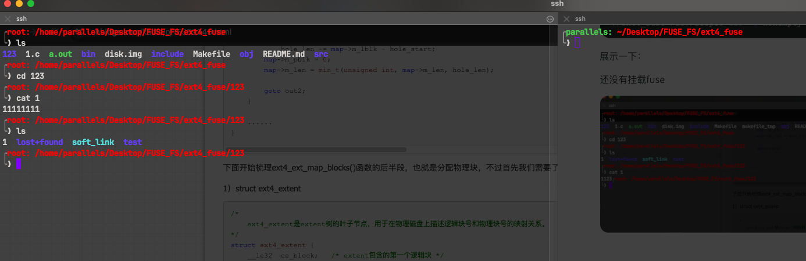
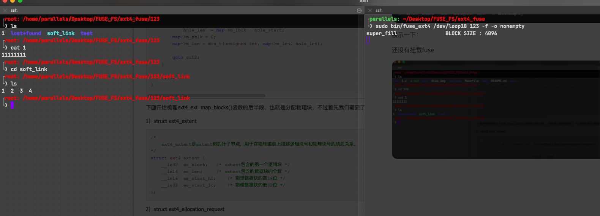
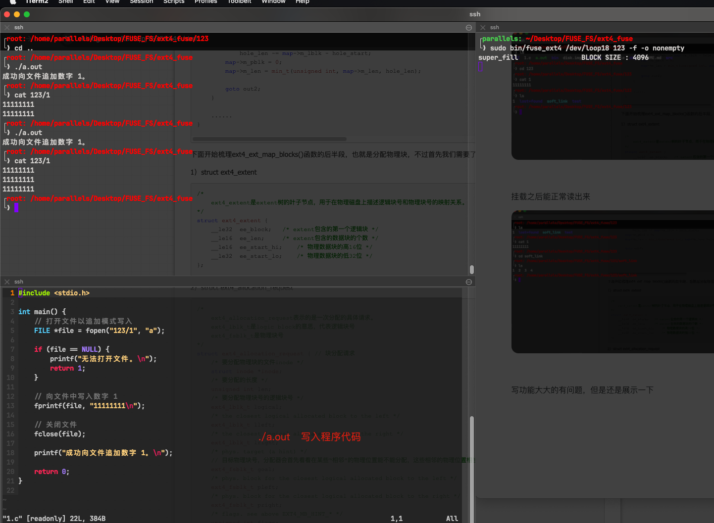
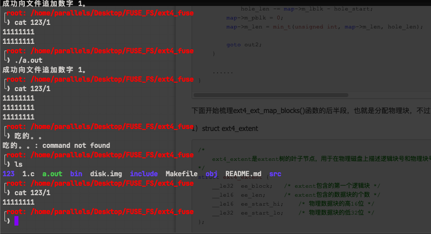
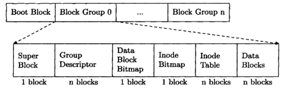
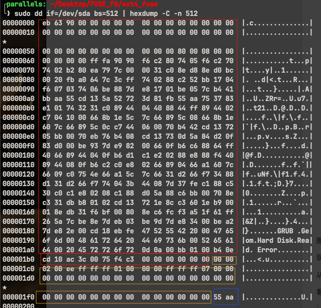
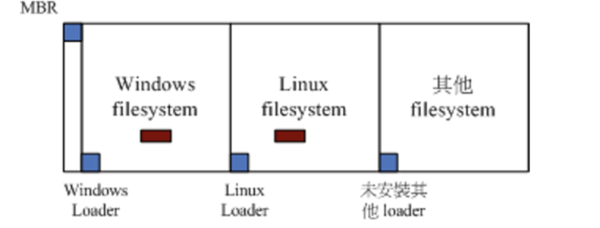
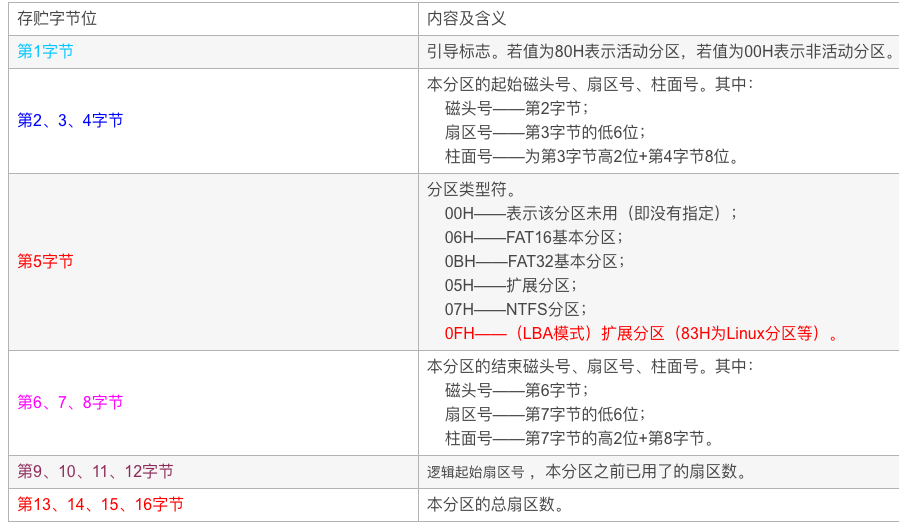
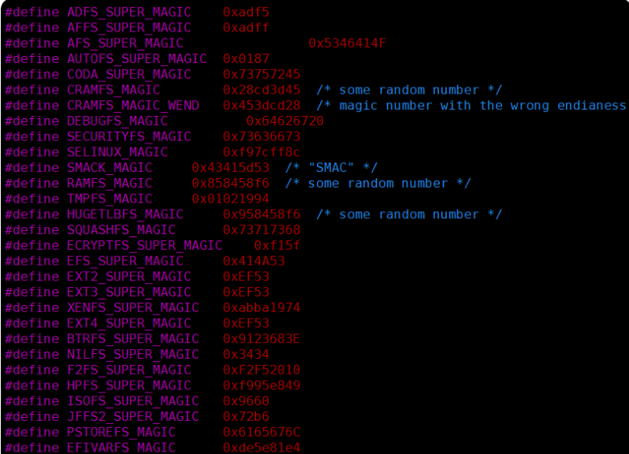
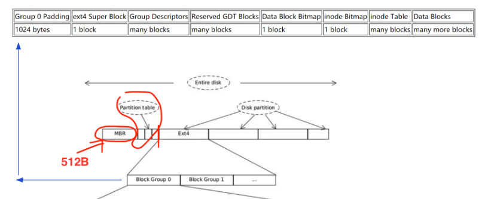

### 事先说明

本项目并不是为本人一手打造，而是模仿另一个作者，我只是copy，理解了一下作为ext4文件系统的学习、fuse的使用，以及经验分享，当然我并不是对着代码就一顿猛b乱抄😊。由于我是理解之后在自己写的，顺便再加了点注释，我认为是比原作者好理解一点的。


> 由于几个文件都是都不是很大，一般来说，要创建的大一点的才能看到ei。或者是多次写入。
>
> 我平时尝试到 只有一层，或者两层最多了
>
> 
>
> 我的write的功能是独创的，超级阉割版的write，巨垃圾，连个分配器的都没有，策略也没有，
>
> Prealloc预分配，多块分配，延迟分配，持久预分配，一个没有，最好还是不要看，只支持append写入😇
>
> 老出bug。
>
> 
>
> 开始看之前可以看看最后的前置知识，不然可能看不懂项目。我代码中大量注释，结合着看应该可以很容易看懂大致的思路。

**原作者GitHub地址：https://github.com/gerard/ext4fuse**


### 项目代码运行流程：

由于这个文件系统不是写在内存中的，是直接落盘的，写在磁盘上的。

这就要求用dd命令虚拟一个磁盘：


挂载流程：

```shell
#虚拟一个磁盘
dd if=/dev/zero of=disk.img bs=1G count=1

#然后losetup -f 随机关联一个loop的设备文件，到底是哪个自己用losetup找一下
losetup -f disk.img

#然后对着这个设备文件，比如说是 /dev/loop18,格式话一下，
mkfs.ext4 .... 

#然后随便挂载在一个目录上比如123
sudo mount /dev/loop18 123

#到了这里，这块虚拟的磁盘，已经可以通过 目录123 写入了，那就先创建一些乱七八糟的文件
。。。。。。

#然后直接用我们写的fuse_ext4再次的挂载在这个目录上
./ext4_fuse /dev/loop18 123 -o nonempty
```

展示一下：

还没有挂载fuse




挂载之后能正常读出来




写功能大大的有问题，但是还是展示一下



> 但是因为我write功能没有修改操作系统内存的file相关的数据结构，出来之后读不出来。
>
> 但是确实是落盘了，再用fuse_ext4挂载上去，就可以看到。




### 一些前置知识（要完全理解项目所需要的一些小细节）

建议先了解一下FUSE是什么，基本的功能是啥，大概的原理是怎么样：

推荐学习网站：https://www.qiyacloud.cn/categories/%E8%87%AA%E5%88%B6%E6%96%87%E4%BB%B6%E7%B3%BB%E7%BB%9F/


##### Ext4文件系统：

Ext4 有2种文件数据管理方式：

- 第一种inline ， 数据保存在inode节点里
- 第二种就是 extent方式，就是把数据B树的方式索引起来。


**extent方式：**

三种数据结构：

```c
/*
ext4_extent_header 该数据结构在一个磁盘逻辑块的最开始的位置，描述该磁盘逻辑块的B树属性，也即该逻辑块中数据的类型（例如是否为叶子节点）和数量。如果eh_depth为0，则该逻辑块中数据项为B树的叶子节点，此时其中存储的是ext4_extent数据结构实例，如果eh_depth>0，则其中存储的是非叶子节点，也即ext4_extent_idx，用于存储指向下一级的索引。
*/
struct ext4_extent_header {
        __le16  eh_magic;       /* 魔数 */
        __le16  eh_entries;     /* 可用的项目的数量 */
        __le16  eh_max;         /* 本区域可以存储最大项目数量 */
        __le16  eh_depth;       /* 当前层树的深度 */
        __le32  eh_generation;  
};

/*
ext4_extent_idx 该数据结构是B树中的索引节点，该数据结构用于指向下一级，下一级可以仍然是索引节点，或者叶子节点。
*/
struct ext4_extent_idx {
        __le32  ei_block;       /* 索引覆盖的逻辑块的数量，以块为单位 */
        __le32  ei_leaf_lo;     /* 指向下一级物理块的位置，*/
        __le16  ei_leaf_hi;     /* 物理块位置的高16位 */
        __u16   ei_unused;
};

/*
ext4_extent 描述了文件逻辑地址与磁盘物理地址的关系。通过该数据结构，可以找到文件某个偏移的一段数据在磁盘的具体位置。
*/
struct ext4_extent {
        __le32  ee_block;       /* 该extent覆盖的第一个逻辑地址，以块为单位 */       
        __le16  ee_len;         /* 该extent覆盖的逻辑块的位置 */  
        __le16  ee_start_hi;    /* 物理块的高16位 */ 
        __le32  ee_start_lo;    /* 物理块的低16位 */         
};
```


三种数据结构的用途：

具体参考 ： https://zhuanlan.zhihu.com/p/52052278 （这人讲的挺好的）

图片就不放了，不想去水印。


**超级块(EXT4)：**

格式化一个ext4文件系统后在磁盘上的结构：



这是超级块在磁盘上的分布，

一个磁盘可以分很多分区，一个分区就是上面的大长方形， 

一个分区可以分很多块组，Block Group， 

> Group
>
> 块组是一个逻辑概念，把一个分区分成若干个组，用来限制文件的数据块不要过于散落，尽量保证一个文件的数据块在一个组，这样可以提高读写效率，


每个组中，有：

- 超级块(`struct ext4_super_block`)每个块组的超级块（superblock）记录的是该块组的相关信息，而不是整个文件系统的所有信息。在ext4文件系统中，超级块包含了文件系统的关键参数、布局和状态信息，例如文件系统的大小、块大小、块组数量、inode数量等。

> ⚠️，这个是块组的超级块，和全局的起始位置的超级块不一样，虽然用的是同一个struct。

- Group descriptors组描述符（`struct ext4_group_desc`）记录了这个组中的inode数量，空闲块数量等信息。一般来说就只有一块。

- Block bitmap是数据块的位图，记录着数据块的状态。

- Inode bitmap是inode的位图，记录着inode的状态。

- Data Blocks， 就是存数据的地方

举个例子就是：

```bat
Group 0: (Blocks 1-8192)
  Primary superblock at 1, Group descriptors at 2-2
  Reserved GDT blocks at 3-246
  Block bitmap at 247 (+246)
  Inode bitmap at 251 (+250)
  Inode table at 255-499 (+254)
  5481 free blocks, 1916 free inodes, 7 directories
  Free blocks: 1268-2657, 2866-4096, 5327-6112, 6119-8192
  Free inodes: 39, 46-1960
```


### 磁盘结构：

> 具体参考 ： https://blog.csdn.net/tsz0000/category_9284940.html 

盘以扇区作为基本的存储单位，目前的扇区大小是512字节。可以通过分区把一个物理硬盘划分为多个逻辑硬盘，每一个逻辑硬盘就是一个分区，每个分区可以使用独立的文件系统格式。硬盘的第一个`扇区`（512B），保存了MBR，分区表和结束标志55AA，其中前446字节为MBR代码，其后64字节是分区表，最后4字节是标志55AA。




> 前面红色区域446字节是<span style="color:#f33b45;">MBR</span>数据，中间黄色区域64字节<span style="color:#ffbb66;">分区信息</span>和<span style="color:#3399ea;">结束标志</span>55AA。
>
> 因为我的是虚拟机，没有分区，分区信息都是0.


**补充：操作系统如何加载的**：

（这里只提老的BIOS奥）

- 首先就是计算机在开机的时候，主板主板运行程序，自检一下，然后看到磁盘，加载了第一个扇区的MBR

- 然后把自己的控制权交给 MBR上的boot loader， boot loader通过MBR上的分区表，看到了有几个分区，然后通过预先定义的程序，让你选择加载哪个操作系统

- 选择不同的操作系统，就会从不同的分区的boot block中拿出 不同操作系统的boot loader，转交控制权

  

  > 注意`MBR上`也有`Loader`，也是在装操作系统的时候装上去的，
  >
  > 之所以要先装windows 是因为windows是闭源的，他的MBR的bootloader不可以把控制权转交给其他操作系统的bootloader,比如Linux_Loader。
  >
  > 所以要后装其他的系统，然后覆盖MBR上的Loader ， 之后再用MBR_Loader 加载WIN_Loader or Linux_Loader.

- 然后通过操作系统自己的boot loader ，加载文件系统上自己的操作系统代码


**在起始扇区的分区表项结构：**




具体什么文件系统还需要读出分区的物理superblock来进行确定：

就是说不能光看偏移为4的那个地方。

关键是哪个文件系统还是要看魔数 (项目中EXT4 的magic 就是 0xEF53) ：






这里的MBR+分区表+结束符 = 512B

ext4 的 0块组前面会有 1024 byte的(Group 0 Padding), 一般的操作系统自带的文件系统会像上图一样。

但是项目中的是空盘，根本没有MBR。。，所以开头就死1024的那个。

⚠️在初始化的时候，(1024 + 第一个super_block) 这其实算是第一块block。


##### 推荐几个链接关于存储方面的技术还有文件系统的：

https://www.zhihu.com/column/c_210330608 （存储技术张我买过书，挺好的，适合彩笔比如我）

https://xiaolincoding.com/os/（小林特别推荐，基础知识巨全）

https://blog.csdn.net/tsz0000/category_9284940.html （介绍EXT4的）

https://ext4.wiki.kernel.org/index.php/Ext4_Disk_Layout （官方文档）

https://www.cnblogs.com/kanie/p/15359346.html （快分配机制的，看的不是很懂）


#### 以上内容，如有侵权行为请联系本人，立刻删除， 联系QQ：3055289403
